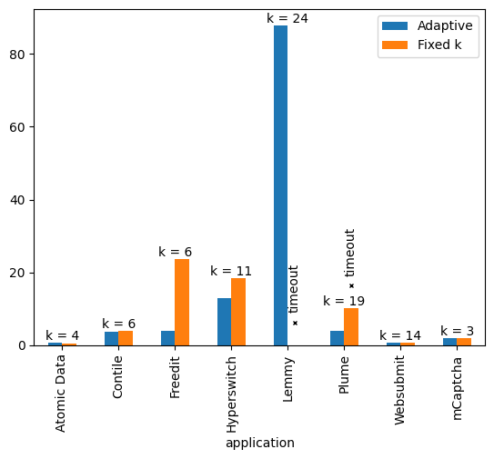
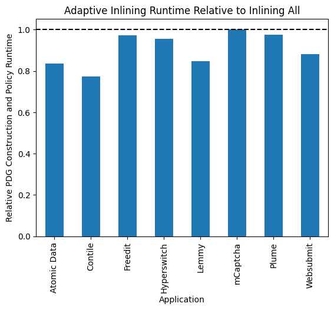

# Artifact for the Submission of "Paralegal" to OSDI 2025

Welcome to the software artifact for the 2025 submission of the static Rust
privacy and security analyzer "Paralegal". This repository ties together the
analyzer, benchmark suite and plotting utilities for reproducing the
graphs shown in the paper.

**This repository is intended for artifact evaluators. If you are interested in
using the software (or benchmarker), you should instead visit the standalone
repos for [the "Paralegal" analyzer](https://github.com/brownsys/paralegal) or
[the benchmarker](https://github.com/brownsys/paralegal-bench), which
have the latest updates.**

If you are receiving this artifact as a docker container (for example from
[Zenodo](https://doi.org/10.5281/zenodo.15313526)) you should start with [Running the Docker
Image](#running-the-docker-image).

If you are instead intending to use [this
repository](https://github.com/brownsys/paralegal-osdi-2025-artifact) from
source, go to the [Setup and Installation](#setup-and-installation) section
**before cloning the repo**.

If you want to learn more about the organization of this repository see
[Organization](#organization).

## Platform Compatibility

The **analyzer** has been tested on Ubuntu and OSX, but should in theory run on any
Linux and possibly Windows too, though no guarantees are made.

The **benchmarker** relies on UNIX features (process groups) and can only run on a
platform that supports it e.g. Linux and OSX.

## Running the Docker Image

You will require bzip2 and `docker` on the command line. This assumes a file
name of `paralegal-osdi25-docker.tar.bz2`

```bash
$ bunzip2 paralegal-osdi25-docker.tar.bz2 | docker image load
```

Verify it has been loaded 

```bash
$ docker image list
TODO
```

Then you can start and connect to the image with the following command. Note the
`--mount` option and the `mkdir` are used here to establish a way to transfer
data from the image to your machine. This is intended to be used later for you
to view the plots.

```bash
mkdir output
docker run -ti --mount type=bind,src="$(pwd)/output",dst=/home/aec/artifact/output paralegal:osdi25-artifact
```

## Setup and Installation

**If this artifact was provided to you as a docker container, you may skip this section.**

This artifact leverages git submodules so you must clone with `--recursive` or
run `git submodule update --init --recursive` after cloning.

```bash
$ git clone git@github.com:brownsys/paralegal-osdi-2025-artifact --recursive
```

You should have [`rustup`](https://rustup.rs/) installed on your system, to
handle the Rust toolchain management. This is necessary because the analyzer
builds against a specific Rust nightly version (see
`paralegal/rust-toolchain.toml`). For Unix you can run 

```bash
$ curl --proto '=https' --tlsv1.2 -sSf https://sh.rustup.rs | sh -s -- --default-toolchain none
# Sets the environment
$ . "$HOME/.cargo/env"
```

Rustup will install the requisite toolchains automatically. You can download the
one necessary for the analyzer and verify that the rustup installation was
successful by running

```bash
$ (cd paralegal && rustc --version)
...
rustc 1.74.0-nightly (58eefc33a 2023-08-24)
```

You will also require python 3 and pip to plot the graphs. Please follow the
[installation instruction for your platform](https://www.python.org/downloads/).
For Ubuntu for example the command is 

```bash
sudo apt install python3 python3-pip
```

To install the dependencies for the plotting script use

```bash
$ python3 -m pip install -r plotting/requirements.txt
```

If you wish to reproduce our CodeQL results you must install CodeQL too. The
results in our paper were obtained with 2.19.3. Download the binaries for your
platform from the
[releases
page](https://github.com/github/codeql-cli-binaries/releases/tag/v2.19.3) and
unzip the archive. You will need this path later to run the evaluator.

```bash
wget https://github.com/github/codeql-cli-binaries/releases/download/v2.19.3/codeql-linux64.zip
unxip codeql-linux64.zip
```

You need to ensure the executable can be found by our comparison benchmark
runner. You may add it to your path (command below) or provide the path directly
to the runner via the `--codeql-command` flag.

```bash
export PATH="$PATH:$(realpath codeql)"
```

In addition running CodeQL requires you have a C++ compiler like gcc or clang as
well as cmake installed.

**This next set of instructions is only if you are operating on Linux.** 

Retrieve the system root for the Rust toolchain, e.g. with my example output

```bash
(cd paralegal && rustc --print sysroot)
/home/justus/.rustup/toolchains/nightly-2023-08-25-x86_64-unknown-linux-gnu
```

You must edit any benchmark configuration (e.g.
`paralegal-bench/bconf/bench-config.toml`) you run. Specifically it will have an
entry like 

```toml
[app-config.hyperswitch.env]
LD_LIBRARY_PATH = "TOOLCHAIN/lib"
```

Replace the `TOOLCHAIN` part with the sysroot path you retrieved.

```toml
[app-config.hyperswitch.env]
LD_LIBRARY_PATH = "/home/justus/.rustup/toolchains/nightly-2023-08-25-x86_64-unknown-linux-gnu/lib"
```

For the curious: this is a workaround to deal with cases where a build script
calls `rustc` to get metadata information. This actually ends up calling our
analyzer again (which wraps around `rustc`), which dynamically links against
`libLLVM`, but for some reason in this nested call the linker cannot find this
library, so we provide the path here.

## Step-by-step for Reproducing Results

You can run all performance benchmarks with

```bash
$ (cd paralegal-bench && cargo run --bin griswold --release -- bconf/bench-config.toml)
```

This will take about 90 minutes.

Performance benchmarks are controlled by the configuration (e.g.
`bconf/bench-config.toml`). Some notes:

- In the paper we run these experiments with 5 repetitions to ensure stable
  results. This option is commented out in the configuration provided to you, as
  the numbers tend to be similar even for just one run and this makes the
  overall runtime almost 5 times lower. If you so desire, you may comment the
  option back in at the top of the file.
- In the configuration the experiments that are known to time out in 15min are
  commented out for your convenience. If you would like to check that they do
  feel free to comment them back in *or* there is also a separate
  `timed-out.toml` configuration you can use to *just* check the experiment
  runs that time out.

The output from the benchmark is written to `paralegal-bench/results`. For more
information on the format see [Performance Benchmarker Output
Format](#performance-benchmarker-output-format). Once the benchmarks have
finished, generate the plots by running `plotting/plot.py`. If you are on the
docker image you will likely want to redirect the output to the mounted `output`
directory as follows:

```bash
$ plotting/plot.py -o output
```

You will find the created plots in the directory you set with `-o` or, if unset,
the `plotting` directory. For explanations of each graph/table, see
[Plots](#plots). The plotting script also supports a number of command line
parameters. Run it with `--help` to learn more. The reference plots we generated
from our experiment run you will find in `plotting/reference`. On docker you may
wish to copy the reference plots to `output` as well for viewing with `cp
plotting/reference output/reference`.

To check our CodeQL comparison you run a similar coordination program to `griswold`. For us
this run took about 10min.

```bash
$ cd codeql-experimentation
$ (cd runner && cargo build --release)
$ runner/target/release/runner --keep-temporaries eval-config.toml
```

If you did not add the `codeql` command to your `PATH`, you should invoke the
runner as 

```bash
$ runner/target/release/runner --keep-temporaries eval-config.toml --codeql-path /path/to/codeql/executable
```

The runner will fail if any build or codeql analysis fails. It will also issue
an "error" log message for every policy where the output diverges from the
expected output with information which policy failed, what the expected output
was and what the actual output was.

## Plots

**General Note:** Since the acceptance of the paper we've made improvements to
Paralegal which make PDG construction faster and allow it to now analyze all
dependencies of a crate. Before we would restrict the set of crates analyzed for
every application and approximate the rest. As a result we're making some
changes to the evaluation setup, using the sounder "all crates" configuration
in many experiments. The changes to each plot/claim are explained in this
section. We generally provide the new plots we want to put in the paper as well
as the old versions or analogous results.

### ide_ci_plot(.png)


The right and side of this graph is an updated version of **Figure 9** in the paper.
The left hand side is new and represents the mentioned "all crates"
configuration. We will change the description in the paper to explain that we
expect this "all crates" setup to be the one user's run in CI, where soundness
is the chief concern and slightly longer runtimes are acceptable. The "Workspace
Crates Only" we believe is more suited for interactive use, especially when only
run on single controllers (see [per_controller_plot](#per_controller_plotpng)).

### per_controller_plot(.png)


This plot is an updated version of **Figure 10** in the paper. Runtimes have gotten
a bit lower, due to optimizations. This uses the "Workspace Crates Only" setup
and shows combined runtime (PDG generation and policy checking).

### k_depth_plot(.png)



This plot is new and set to replace **Figure 11** in the paper. The purpose of
this plot remains the same. It quantifies the impact of using our marker-guided
"adaptive inlining" optimization. The graph compares total runtime (PDG
generation + policy check) for Paralegal when using "adaptive inlining" vs a
fixed-k limit. Both approaches limit the depth of function call stacks that will
be represented in the PDG. Both cases use the "all crates" setup.

Each application uses a different fixed k. The idea is to pick a k, that
creates a graph with the same fidelity as the adaptive approach, yet one that is
as small as possible, so that we observe the best possible performance for
fixed-k. To facilitate this we pick, for each application, the maximum k that
the "adaptive" setup explores. This guarantees both that the fidelity of "fixed-k"
is at least as good as for "adaptive" *and* because of how "adaptive" chooses
whether to continue exploring a call tree it is also guaranteed that this k is
the smallest possible sound k.

One might also suggest using a k = infinity, but as you can infer from the
timeouts just in this case, most of those will not terminate. Hence we pick a
smaller (optimal) k. We acknowledge that the "fixed-k" setup is unrealistic,
since it relies on an oracle to pick the correct k. The argument is that even in
this (idealistic) case, "adaptive inlining" *still* offers substantial
improvements.

Note on the Plume result: We run both a the buggy and fixed version of the app.
The buggy one finished with the time shown, the fixed one time out, hence both
the bar and the timeout marker.

### old_adaptive_plot(.png)



This plot is a recreation of **Figure 11** from the paper with the new
numbers/optimizations. This plot is provided for transparency, it will be
removed from the paper.

The setup is similar to [k_depth_plot](#k_depth_plotpng), however here k =
infinity, but we only run on the "Workspace Crates", massively reducing the code
needing to be analyzed at the cost of soundness.

This graph shows that "Adaptive Inlining" is still generally faster, though the
gains are less pronounced.

### dependency_times(.txt)

[Table](plotting/reference/dependency_times.txt)

The graphs shown so far do not include the time needed to compile the
dependencies before running the PDG generation. This is only needed once (for
each dependency change). In the paper we plan to add a sentence to **Section
7.4** about the overhead Paralegal introduces to this dependency compilation,
because we persist the MIR bodies for each dependency in addition to the
compilation. The claim will be similar to:

> As a rustc plugin Paralegal must compile the dependencies first before it can
> generate a PDG. In addition Paralegal dumps the MIR code for each function in
> the dependencies in top of compilation. This creates at most a 4% overhead
> over just compiling the dependencies.

The substantiating column in the table is "Dump Time % Share" which is
calculated as dividing "Dep. Comp. CPU Time" (CPU time spent on compiling
dependencies) by "Dep. Dump CPU Time" (CPU time spent persisting MIR).

"Wall Clock Dependency Time" is provided for convenience, showing actual time
used, when dependency compilation is parallelized.

### atomic_data_locs(.txt)

[Table](plotting/reference/dependency_times.txt)

This table shows the calculated numbers we quote in **Section 7.3**. In the second
table we quote the numbers from the "LoC Workspace" column, as this represents
the lines of code that could cause a marker change. We plan to add the "Mean
#LoC changed" from "LoC Including Deps" statistic to the paper with something
like

> Within the 937 functional commits, 84 commits change one or more code lines
> touched by the analysis (1165 LoC changed on average). Of those 66 commits
> modify lines in the workspace (60 lines change on average) and could cause an
> adjustment to the markers.

## CodeQL Comparison

The `codeql-experimentation` contains the code for our comparison with CodeQL.

The `runner` program provides a convenient way to run the specific examples we
mention in the paper. Effectively it runs a sequence of shell (build) commands,
then compares the output from codeql to the examples in `expected`. Similar to
`griswold` each run of this tool creates a new output `results/<timestamp>`.
There you'll find stdout and stderr from all called commands. Furthermore if you
run it with `--keep-temporaries` you can see the captured codeql output in
`results/<timestamp>/tmp`.

If you want to run the examples manually then you must do the following. Take
the "Plume" example, which also has the third party library "plib" and we use
the "plume-data-deletion.ql" policy.

```bash
cd cpp/plume
cd plib
mkdir build
cd build
cmake ..
cmake --build .
cd ..
codeql database create --overwrite qdb --language cpp
codeql query run -d qdb ../../real-world-policies/plume-data-deletion.ql
```

And now compare that output to `expected/plume-data-deletion.ql`.

### Explanations of Expected Outputs

- **Plume Data Deletion Policy**: This policy matches user data to deletion sink
  flows. We tried it for three types of user data, and as such if output
  contains three rows fetching different types of data and three calls to an
  appropriate delete sink we can call this policy succeeding.
- **mCaptcha Limited Collection Policy**: The policy checks for the presence of
  a function call that authorizes the collection of data and a control flow
  influence of its return value on the collection. If the CodeQL output contains
  that function call, then this policy recognized that the code does not contain
  a violation.
- **mCaptcha Deletion Policy**: The output is a tuple showing where the private
  data is retrieved in the delete controller and where the delete method is
  called on it. Since we only test one type of private data, if the CodeQL
  output contains at least one row, we can call the policy succeeding.
- **Lemmy Instance Policy**: The policy checks whether there exists a retrieval
  for data connected to an "instance" without prior check that the requesting
  user is banned or deleted from that instance. If CodeQL output is empty it
  would recognize our code is non-violating. The actual output contains two
  rows, demonstrating that it works for the simple case (in the "perform"
  entrypoint) but not the async case ("perform_async") entrypoint. It also shows
  the call in line 118, because we haven't yet implemented to only check
  function bodies reachable from the entrypoint (that one is our bad). 
- **Atomic Safe Writes Policy**: This policy fragment represents the premise of
  the full policy, finding a write to a specific type of data. The CodeQL output
  should show this data flow, but it doesn't. This means a full policy would be
  vacuously succeeding (false negative).
- **Websubmit Deletion Policy**: The output is a tuple showing where the private
  data is retrieved in the delete controller and where the delete method is
  called on it. We test four types of private data and therefore if the CodeQL
  output contains four rows with those types mentioned it would be succeeding.
  The output we observe is empty.
- **Websubmit Disclosure Policy**: This policy fragment represents the premise of
  the full policy, finding sensitive data that is is written to an external
  sink. The CodeQL output should show at least one flow but doesn't. This means
  a full policy would be vacuously succeeding (false negative).
- **Websubmit Scoped Storage Policy**: This auxiliary policy to data deletion
  wants to check that user data is associated with an appropriate identifier in
  storage. The policy as written tests the premise that sensitive data is being
  stored. The CodeQL output should show this flow but doesn't. This means a full
  policy would be vacuously succeeding (false negative).
- **Freedit Expiration Policy**: This policy fragment is part of the conclusion
  of the full policy, checking that the output from a call to retrieve the time
  (`system_clock::now`) reaches a conditional check to guard the deletion of
  expired data. The CodeQL output should show this flow but doesn't. This means
  a full policy would be vacuously failing (false positive).
- **Freedit Storage Policy**: This is an auxiliary policy to the expiration
  check that asserts that user records must be stored with a timestamp. The file
  being run here is a policy fragment that tests the premise of the policy,
  finding the storage calls for user records. The CodeQL output show show at
  least one such call but doesn't. This means a full policy would be vacuously
  succeeding (false negative).

## Organization

**Make sure you've fetched the submodules by cloning with `--recursive` or
run `git submodule update --init --recursive`**

This artifact is organized as follows:

- The `paralegal` directory contains the source code for the analyzer. The most
  important subdirectories are

  - `crates/paralegal-flow` is the PDG constructor. It wraps around `cargo` and
    `rustc`, functioning as a compiler plugin. It can be installed via `cargo
    install --locked --path crates/paralegal-flow` and run via `cargo
    paralegal-flow` in the directory of a target rust project to analyze. It
    also accepts a `--help` flag to show command line configuration options.
  - `crates/paralegal-policy` contains the low-level Rust API for policy
    enforcement, which is used by the compiler (`paralegal-compiler`).
  - `crates/paralegal` is the annotation library that a target rust project
    should link against to add inline annotations, e.g. `#[paralegal::analyze]`
    or `#[paralegal::marker(...)]`.

  For more documentation on the analyzer see the [online
  documentation](https://brownsys.github.io/paralegal).

- The `paralegal-bench` directory contains the performance benchmark coordinator
  and source code for our use cases.

  - `bconf` contains configuration files for various benchmark runs. The most
    important one being `bench-config.toml`, which is the one used to produce
    all results we present in the paper.
  - `griswold` is the benchmark driver/coordinator. You can run it via `cargo
    run --bin griswold`. It takes as input a run configuration (for example
    `bconf/bench-config.toml`). It writes outputs to the `results` directory.
    See the `--help` option of the [Benchmarker output
    Format](#performance-benchmarker-output-format) section for more details on the
    structure of results.
  - `case-studies` contains a copy of the source code for our case studies.
    These corresponds to the commits listed in [Case study
    versions](#case-study-versions) with some small changes applied as explained
    in the paper appendix.
  - `paralegal-compiler` contains the source code for the compiler of the
    high-level policy language. Can be run via `cargo run -p
    paralegal-compiler --release`.

    - The policies used in the paper and corresponding to our case studies are
      in the `policies` subdirectory.

- The `plotting` directory contains python scripts to plot the graphs. Install
  the dependencies with `python3 -m pip install -r plotting/requirements.txt`.

- The `codeql-experimentation` directory contains our C++ translations of
  applications and the CodeQL translations of our policies.

  - `cpp` contains C++ source code for examples we tried with CodeQL, including
    the source for our application translations.
  - `runner` coordination program for replicating our codeql findings
  - `eval-config.toml` an index file for which policies should be run on which
    application. Input to the `runner`.
  - `real-world-policies` the ql source code for our policy translations
  - `expected` CodeQL output as we observed it
  - `policy-coding` raw data of how we labeled sections in the CodeQL policies


## Performance Benchmarker Output Format

This section explains the output structure create by the `griswold` benchmark coordinator.

Results are written to the `--result-path` argument (default to "results"). Each
time you call `griswold` it creates a new set of directories. They all have
the format `<timestamp>-<purpose>` with the following purposes:

- `logs`: stdout and stderr from the PDG generation (called `compile`) and
  combined output from the policy 
  
- `pp`: The source code that was involved in the analysis. The lines of code
  actually visited. This is used in the roll-forward experiment
- `run`: Everything considered result data which are the following files:

  - `results.csv`: incrementally written statistics and results for each run.
  - `controllers.csv`: incrementally written statistics about individual
    controllers. 
    
    Multiple such statistics are written for a single run. The `run_id` field
    tells you which run each row belongs to. 
  - `sys.toml`: information about the system that this experiment was run on.
  - `bench-config.toml`: a copy of the configuration that was input to this run


## Case Study Versions

| Application | Source Repo | Commit |
| --- | --- | --- |
| Atomic Data | https://github.com/atomicdata-dev/atomic-server | `46a503adbfc52678c97e52f6e8cfaf541aa6492d` |
| Contile | https://github.com/mozilla-services/contile | `2bdf4072925d199c1b75d1f76f656c34325e5e8a` |
| Freedit | https://github.com/freedit-org/freedit | `b25e3781a8f46506046bb92f9bfc1ce85a9c9b6d` |
| Hyperswitch | https://github.com/juspay/hyperswitch | `6428d07f983026245159de4147b62bc0fc018165` |
| Lemmy | https://github.com/LemmyNet/lemmy | `b78826c2c80567192b4e2ce5f8714a094299be04` |
| mCaptcha | https://github.com/mCaptcha/mCaptcha/ | `9922c233220751e9611b42414ecd82fcde757480` |
| Plume | https://github.com/Plume-org/Plume | `613ccbcd945618cce624725aee3e2997cbf6de38` |
| Websubmit | https://github.com/JustusAdam/beavered-websubmit | `4b4713845494b14e92b01c05ec32e7d429eb524f` |